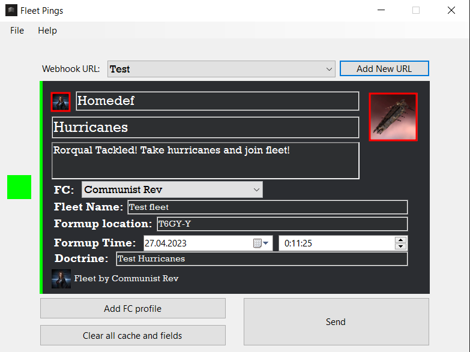

# EVE-Online-Fleet-Pings
 
This application allows to create fleet pings in Discord for EVE Online in the form of formatted messages with the necessary fields and images.

DO NOT MODIFY "Cache" FOLDER, IF YOU ARE NOT SURE, WHAT YOU ARE DOING!

General instructions:

1) Create a webhook on the target server:

2) Add Ping To App

3) Click on picture boxes in left and right top corners and choose pictures

You need to download any image using "add new logo" dialog window (all downloaded images will be saved in cache)

4) Add FC Profile. It\`s necessary to copy your character\`s ID (you can use zkillboard.com).

And Choose Created profile in the list

5) Set ping time (You should use your local time, not ET. It will be automatically converted to local time for all users by Discord)

6) Click "Send"

Features:

1) Last ping automatically saves, when you click "Send" if the ping is created correctly. You can load it with "Load last ping" option ("File" menu)

2) You can save and load pings using json format ("File" menu)

3) Bug reports and suggestions send to:

Discord: \[FFSCS\] Communist Rev#6385
Github: https://github.com/Communist-Rev
EVE Online: Communist Rev